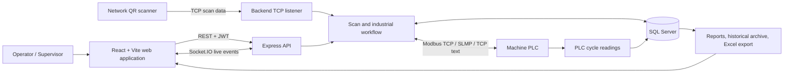
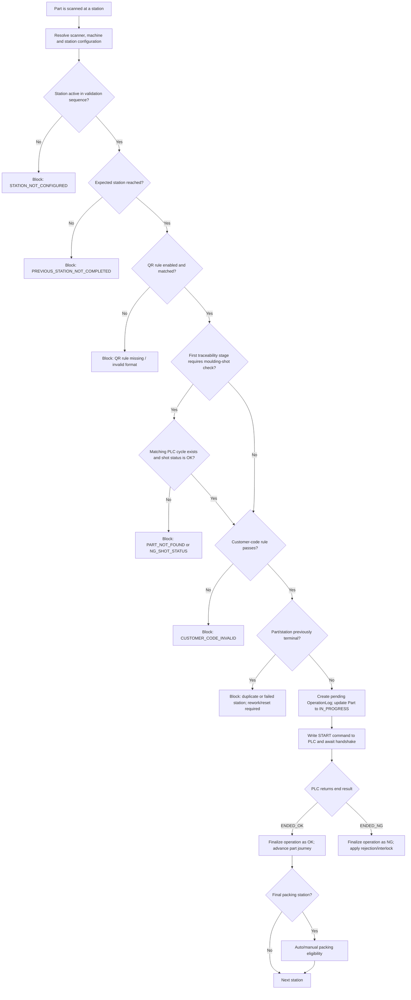
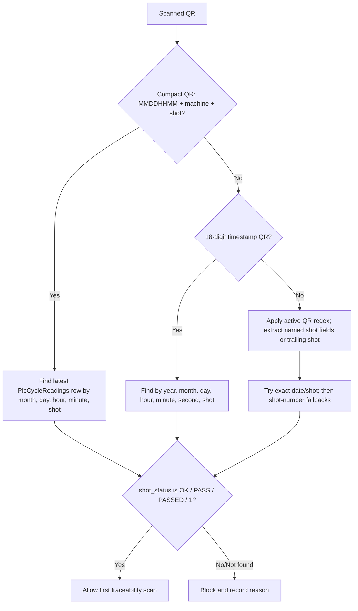
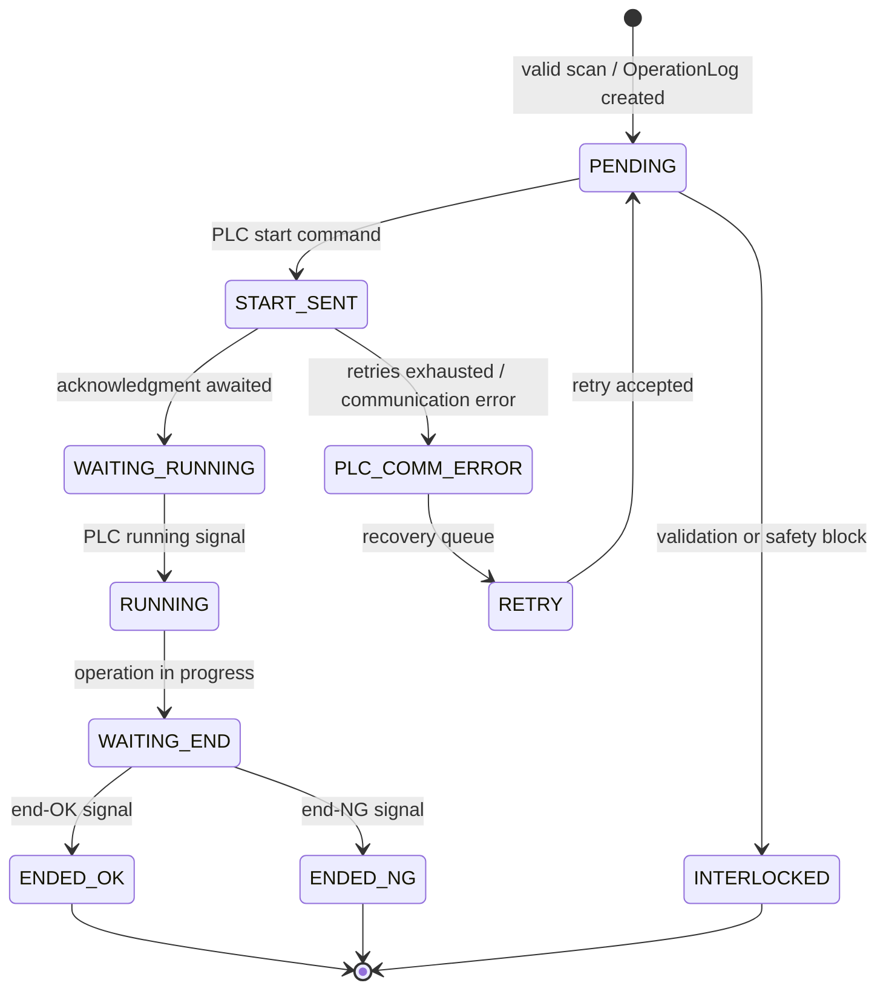
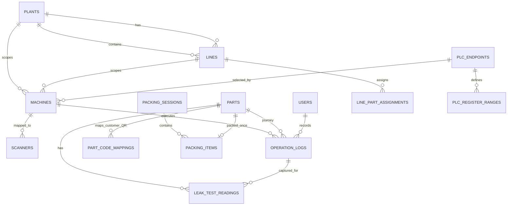
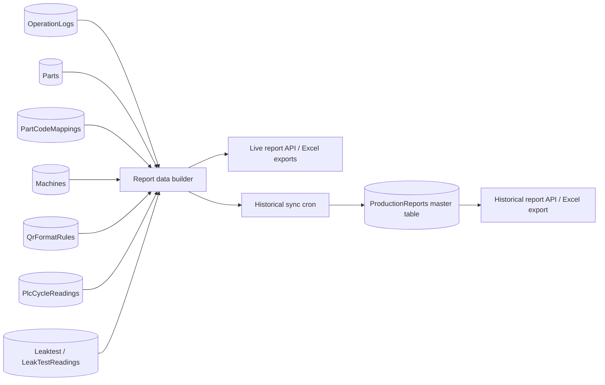

# IndusTrace / Traceability System

## 1. Purpose and scope

IndusTrace is a manufacturing traceability system for a sequential production line. It accepts a part QR scan at a configured station, verifies that the part is valid and eligible to proceed, starts and observes the PLC-controlled operation, records the resulting quality decision, and makes the complete journey available in real time and in reports.

The documentation below describes the implementation in this repository. Table names use the Sequelize model name unless a physical table name is explicitly configured.

## 2. Solution at a glance

| Layer | Responsibility | Main implementation |
|---|---|---|
| User interface | Login, masters, operator operation, monitoring, traceability, packing, reports | `frontend/src` |
| API and real-time service | REST APIs, JWT authorization, Socket.IO, TCP scanner server, startup/recovery | `backend/server.js`, `backend/routes/v1` |
| Traceability workflow | Scan validation, sequence control, PLC handshake, finalization, interlocks | `backend/services/scanService.js`, `backend/services/*` |
| Shop-floor integration | Scanner TCP input and Modbus/SLMP/TCP-text PLC communication | `backend/tcp`, `backend/services/plcProtocols` |
| Data layer | SQL Server via Sequelize plus PLC and leak-test source tables | `backend/models`, `backend/config/db.js` |

## 3. Primary operational process

## 4. Scan validation gates

The decisive scan logic is `saveScan()` in `backend/services/scanService.js`. Station-level feature settings can disable selected checks; the standard API may explicitly enforce QR and sequence validation.

| Order | Check | Main source tables / configuration | On failure |
|---:|---|---|---|
| 1 | Required QR/part ID and station | Request / scanner payload | `INVALID_INPUT` |
| 2 | In-flight guard for same part + station + machine (default 8 seconds) | In-memory `scanInflightKeys` | `DUPLICATE_SCAN_IN_FLIGHT` |
| 3 | Station is in the active validation sequence | `Machines` (`sequence_no`, `is_active`, operation), scanner availability | `STATION_NOT_CONFIGURED` |
| 4 | Previous operation is completed and current scan is at expected station | `OperationLogs`, `Parts`, machine sequence | `PREVIOUS_STATION_NOT_COMPLETED` |
| 5 | Active QR rule is available, applicable and regex-matches | `QrFormatRules` scoped by station, plant/line/machine | `QR_RULE_NOT_FOUND_FOR_STATION`, `INVALID_QR_FORMAT`, `QR_RULE_CONFIG_ERROR` |
| 6 | First-stage moulding/shot validation | `PlcCycleReadings` and active `QrFormatRules` | `PART_NOT_FOUND`, `NO_SHOT_NUMBER`, `NG_SHOT_STATUS` |
| 7 | Previous terminal NG or leak-test NG has not locked the part | `OperationLogs`, `LeakTestReadings` / `Leaktest` | `PREVIOUS_STATION_NG`, `LEAK_TEST_NG` |
| 8 | Optional customer code pattern matches | `StationFeatureSettings.config` | `CUSTOMER_CODE_INVALID`, `CUSTOMER_CODE_RULE_INVALID` |
| 9 | No completed/failed terminal result already exists at this station | `OperationLogs` for this part and linked customer-QR part IDs | `DUPLICATE_SCAN`, `ALREADY_FAILED_AT_STATION`, `ALREADY_COMPLETED` |
| 10 | Current station still equals expected station after all prior checks | `OperationLogs`, `Parts`, machine sequence | `SEQUENCE_MISMATCH` / previous-station block |
| 11 | Submitted manual/scan result is not NG | Scan request/result source | Creates NG log and returns a blocked result |

Important behavior:

- A new valid part is created in `Parts` as `IN_PROGRESS` when first seen.
- A valid scan creates an `OperationLogs` record with `plc_status=PENDING`, `validation_result=PASSED`, and `operation_result=WAITING`.
- A blocked validation may also write an `OperationLogs` audit record, especially for PLC-shot and duplicate/interlock cases.
- Rework status permits controlled reprocessing where normal duplicate/terminal protections would otherwise block it.
- A first-station shot is accepted only when its moulding record is an OK/pass status; warm-up, offset and NG statuses are blocked.

## 5. PLC-shot and leak-test matching

Leak-test records are used both during live flow and report enrichment. `LeakTestReadings` stores captured payloads connected to a part, machine, station and optional operation log. The external/source `Leaktest` table supplies fields such as QR, result, body leak, gall values, cycle time and mode. A failed leak-test stage blocks later stations unless the part enters rework.

## 6. PLC operation lifecycle

PLC protocol and signal configuration is controlled per machine or endpoint. Supported protocols are `MODBUS_TCP`, `SLMP`, and `TCP_TEXT`. The effective PLC map may include start, running, end-OK, end-NG, reset, block, heartbeat and bypass registers; hold times, debounce polling, retries, timeouts and reconnect intervals are machine settings.

## 7. Core data model

### Operational tables

| Table/model | Purpose | Important fields used by logic |
|---|---|---|
| `Parts` | Current state, one row per internal traceability QR | `part_id`, current operation/station, `status`, `is_interlocked`, `interlock_reason`, `qr_format_name`, `is_rework` |
| `OperationLogs` | Immutable-ish operation/validation history and PLC lifecycle | part, machine, station/operation, result, PLC status/times, validation and operation results, user, rejection and bypass fields, cycle token |
| `ProductionLogs` | Compact OK/NG production counters/history | part, machine, user, status, NG reason |
| `FinalProductionResults` | Materialized final production result used by reporting/metrics | final outcome and aggregated production result |
| `ProductionReports` | Historical/master report projection produced by scheduled sync | part/customer QR, status, station statuses, PLC/leak data, raw logs, timestamps |
| `PartCodeMappings` | Links internal/old part IDs and customer QR values | old part ID, customer QR, machine, station, active flag |
| `LeakTestReadings` | Captured leak-test payload for a traceability part/stage | part, machine, station, operation log, JSON payload |
| `Leaktest` | External/source leak-test readings | QR, result/status, cycle end time, leak measurements |
| `PlcCycleReadings` | PLC/moulding source data (queried directly) | shot timestamp/number, machine, status, recorded time and process readings |

### Configuration and access tables

| Table/model | Purpose |
|---|---|
| `Plants`, `Lines`, `LinePartAssignments` | Organizational scope, part/die assignment and production context |
| `Machines` | Sequence, active state, scanner/PLC link, protocol/register map, cycle and reliability settings |
| `Scanners`, `ScannerConnections` | Scanner-to-machine mapping and connection/last-data health |
| `StationFeatureSettings` | Enables QR, operation, rejection bin, manual result, packing, PLC part count and JSON validation switches per station |
| `QrFormatRules` | Active regular-expression rules with part/model, station and plant/line scope |
| `PlcEndpoints`, `PlcRegisterRanges` | Reusable PLC endpoints and register-range plans |
| `Shifts` | Shift windows used for live metrics and reports, including overnight shifts |
| `RoleAccessSettings`, `Users` | Module-level permissions plus individual overrides; users are bcrypt-hashed |
| rejection master tables | `RejectionCategories`, `RejectionReasons`, `RejectionViews`, `RejectionZones`, `RejectionSubZones`, `RejectionZoneReasons` provide structured NG classification |
| `PackingManagementSettings`, `PackingSessions`, `PackingItems` | Box-number policy, capacity and single-part packing history |
| `AuditLogs`, `Alarms`, `MachineRuntimeStates` | Administrative audit trail, operational alarms and live machine runtime state |

## 8. Reporting and historical synchronization

The report builder anchors on `OperationLogs` in the requested date/scope, then loads the complete history for matching part IDs. It deduplicates each part/station by preferring `ENDED_OK`, then `ENDED_NG`, then the newest event. It enriches the rows with part/customer QR mapping, machine/line details, QR model, PLC readings and leak-test readings. Pagination groups rows by traceability part, preserving a part’s station journey together.

The historical synchronization process uses the same full report logic, groups records by part, calculates first/final scan times and station status columns, and upserts the result to `ProductionReports`. A production report is `NG` if any final grouped row is NG; otherwise it is `PASSED` after a successful configured final stage (currently OP150/OP160 or a marked final inspection); otherwise it remains `IN_PROGRESS`.

## 9. Packing process

1. Resolve a scanned internal part ID or active customer-QR mapping.
2. Read `Parts`; only a completed/pass status is eligible.
3. Confirm the final materialized/report status is passed and, when configured, the part came from a final packing station.
4. Reject a part already present in `PackingItems`.
5. Use the requested open box or create/select an auto box according to `PackingManagementSettings`.
6. Reject a closed or full box. Otherwise create `PackingItems`, increment `PackingSessions.packed_count`, and close/label the box at capacity.
7. Emit `packing_update` and, if enabled, open the next box automatically.

## 10. Security, resiliency and real-time behavior

| Area | Implemented behavior |
|---|---|
| Authentication | Login issues JWT; protected routes use `Authorization: Bearer <token>` and `verifyToken`. |
| Authorization | Module access has `HIDDEN`, `VIEW`, `VIEW_EDIT`, `VIEW_CONTROL`; per-user page overrides can supersede the role default. |
| Passwords | `Users` passwords are hashed using bcrypt hooks before create/update. |
| Audit | Administrative/request audit middleware and `AuditLogs`; alarms are maintained in `Alarms`. |
| Live updates | Socket.IO emits machine/scanner status every 5 seconds and workflow, PLC, alarm, packing and database connectivity events. |
| PLC robustness | Connection pooling, health checks, retries, recovery queue, backpressure, circuit/handshake management, signal stability and watchdog services. |
| Database outage | HTTP/TCP/Socket services remain alive in degraded mode; database reconnect retries run every 10 seconds while unavailable and stabilize at 30 seconds after recovery. |
| Offline/recovery | Offline buffering, dead-letter/retry mechanisms and startup recovery support interruption handling. |

## 11. User-facing modules

| Module | Main outcome |
|---|---|
| Dashboard / Production charts | Live counts, quality, trends, OEE/OA and alerts |
| Operator view | Guided scan, validation feedback, PLC operation and manual-result interaction |
| Traceability / Component journey | Full part history, sequence, rework and reset/interlock actions |
| IO monitor / PLC configuration | PLC health, snapshots, diagnostics, commissioning, recovery, endpoint/register configuration |
| Masters | Plants, lines, part assignments, machines, scanners, shifts, users, QR rules, station settings and role access |
| Rejection configuration and analysis | Configure category/reason and visual zones; analyze NG outcomes |
| Packing | Open/close boxes, scan completed parts, generate labels and manage capacity |
| Reports | Live, historical, NG, audit and Excel exports with PLC and leak-test enrichment |

## 12. Deployment and operating notes

- Backend starts with `npm start` in `backend`; frontend builds with `npm run build` in `frontend`.
- Backend defaults to port `3000`; runtime configuration is loaded from `backend/.env`. Frontend endpoint configuration is loaded from its environment files.
- The server initializes schema safeguards, default organization/admin/shifts, scanner state reset, startup recovery and industrial services when the database is reachable.
- Database auto-alter is disabled by default. Use managed migrations and the SQL/index scripts for production changes.
- Keep PLC endpoint addresses, scanner addresses, JWT secrets and database credentials in environment/configuration files; do not place them in this document or source control.

## 13. Source-of-truth map

| Question | Primary source |
|---|---|
| Where should the part go next? | Active `Machines` sequence plus completed/failed `OperationLogs`; current `Parts` state is synchronized to this result. |
| Is this QR format allowed here? | Active scoped `QrFormatRules` plus `StationFeatureSettings`. |
| Does the moulding shot exist and pass? | `PlcCycleReadings`, matched from QR timestamp/shot fields. |
| Is the part already processed or blocked? | `OperationLogs` terminal events and `Parts.is_interlocked` / `status`. |
| Why is the part NG? | `OperationLogs` result/interlock/rejection fields and leak-test state. |
| Can it be packed? | `Parts`, final report/materialized status, final-packing station settings and `PackingItems`. |
| What is shown in a report? | Enriched `OperationLogs` history plus `Parts`, mappings, PLC and leak-test sources; historical view uses `ProductionReports`. |
