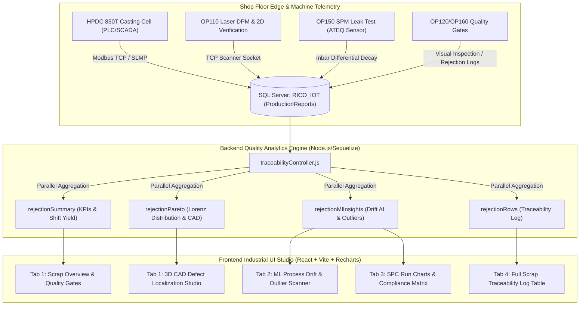

# Rejection Analysis & Defect Localization Studio — Comprehensive Technical & Quality Engineering Specification Guide

```
====================================================================================================
  DOCUMENT ID     : DOC-RICO-TRC-QA-001                      REVISION     : v3.0 (Master Engineering Spec)
  MODULE          : Rejection Analysis & Defect Localization  SYSTEM       : HPDC Traceability 4.0
  PART REFERENCE  : OIL PAN K-12 (Die Casting DCM 850T)       PLANT        : Rico Auto Industries Ltd.
  COMPLIANCE      : IATF 16949:2016 / ISO 9001:2015 / VDA 6.3 / Maruti Suzuki Green-Dot Quality
====================================================================================================
```

---

## 1. Executive Summary & Quality Architecture

The **Rejection Analysis & Multi-Angle Defect Localization Studio** is a mission-critical, enterprise-grade Industrial IoT (IIoT) quality analytics platform. Built specifically for High-Pressure Die Casting (HPDC) and automated multi-station machining/inspection lines, the system bridges real-time SCADA telemetry, automated pneumatic leak sensing, visual defect capture, and Statistical Process Control (SPC) into a single, high-resolution traceability architecture.

### 1.1 Ingestion & High-Performance Analytical Data Flow



---

## 2. Complete Mathematical, Statistical & Machine Learning Formulas

This section details the mathematical and statistical formulations implemented across all KPI scorecards, speedometer gauges, SPC charts, ML drift algorithms, and parameter compliance cards.

---

### 2.1 Scrap Rate & Defect PPM (Automotive Standards)

#### 1. Shop Scrap Rate Percentage ($\%$)
Quantifies the total manufacturing loss across all inspection gates relative to total inspected volume:
$$\text{Scrap Rate } (\%) = \left( \frac{N_{\text{NG}}}{N_{\text{OK}} + N_{\text{NG}}} \right) \times 100$$
* **$N_{\text{OK}}$ (OK Conforming Units):** Parts validated with overall status `OK`, `PASSED`, or `COMPLETED_OK`.
* **$N_{\text{NG}}$ (Non-Conforming Scrap Units):** Parts rejected with status `NG`, `FAILED`, `ENDED_NG`, or failing any intermediate gate (OP100–OP160).

#### 2. Conforming First Pass Yield ($FPY$)
$$\text{First Pass Yield } (FPY) = \left( \frac{N_{\text{OK}}}{N_{\text{OK}} + N_{\text{NG}}} \right) \times 100 = 100\% - \text{Scrap Rate } (\%)$$

#### 3. Defect PPM (Parts Per Million — IATF 16949 / OEM Standard)
Standardized automotive metric reflecting the projected defect count per one million components manufactured:
$$\text{Defect PPM} = \left( \frac{N_{\text{NG}}}{N_{\text{OK}} + N_{\text{NG}}} \right) \times 1,000,000$$

| Defect PPM Range | Scrap Rate Equivalent | Plant Status Band | Operational Action |
|---|---|---|---|
| $< 10,000 \text{ PPM}$ | $< 1.00\%$ | 🟢 **Controlled (Green)** | Normal serial production; standard SPC monitoring. |
| $10,000 - 25,000 \text{ PPM}$ | $1.00\% - 2.50\%$ | 🟡 **Watchlist (Amber)** | Target threshold; shift supervisor notified. |
| $25,000 - 50,000 \text{ PPM}$ | $2.50\% - 5.00\%$ | 🟠 **Elevated Risk (Orange)** | Immediate containment; sample audit at OP120/OP150. |
| $> 50,000 \text{ PPM}$ | $> 5.00\%$ | 🔴 **Critical Violation (Red)** | Line stoppage; 8D root-cause investigation required. |

---

### 2.2 Pareto 80/20 Cumulative Distribution & Ranking

Identifies the "vital few" defect reasons and categories causing $80\%$ of total shop rejections.

#### 1. Individual Defect Contribution Percentage
$$\text{Contribution } (\%)_k = \left( \frac{\text{Count}_k}{\sum_{i=1}^M \text{Count}_i} \right) \times 100$$

#### 2. Lorenz Cumulative Distribution Curve ($C_k$)
$$C_k = \left( \frac{\sum_{j=1}^k \text{Count}_j}{\sum_{i=1}^M \text{Count}_i} \right) \times 100 \quad \text{where } k = 1, 2, \dots, M$$
* The **$80\%$ Pareto Cutoff Reference Line** is plotted at $y = 80\%$ on the secondary axis. Rejection causes to the left of the intersection represent the primary candidates for Kaizen and Corrective Action Plans (CAPA).

---

### 2.3 Telemetry & Statistical Process Control (SPC) Core Metrics

Calculated across all continuous casting SCADA variables ($n$ sample parts, parameter $X$).

#### 1. Population Arithmetic Means ($\bar{X}, \mu_{\text{OK}}, \mu_{\text{NG}}$)
* **Overall Sample Mean ($\bar{X}$):**
  $$\bar{X} = \frac{1}{n} \sum_{i=1}^n X_i$$
* **Conforming Group Mean ($\mu_{\text{OK}}$):** Baseline arithmetic mean of parts validated as `OK`.
  $$\mu_{\text{OK}} = \frac{1}{n_{\text{OK}}} \sum_{i \in \text{OK}} X_i$$
* **Scrapped Group Mean ($\mu_{\text{NG}}$):** Arithmetic mean of parts rejected as `NG`.
  $$\mu_{\text{NG}} = \frac{1}{n_{\text{NG}}} \sum_{i \in \text{NG}} X_i$$

#### 2. Sample Standard Deviation ($s_{\text{OK}}, s_{\text{NG}}$)
$$s_{\text{OK}} = \sqrt{\frac{1}{n_{\text{OK}}-1} \sum_{i \in \text{OK}} (X_i - \mu_{\text{OK}})^2}, \qquad s_{\text{NG}} = \sqrt{\frac{1}{n_{\text{NG}}-1} \sum_{i \in \text{NG}} (X_i - \mu_{\text{NG}})^2}$$

#### 3. Recipe Setpoint Nominal & Mid-Mean ($\mu_{\text{mid}}$ / $\text{SetPoint}$)
The theoretical or nominal operating center of the casting recipe:
$$\mu_{\text{mid}} = \text{SetPoint} = \begin{cases} 
\dfrac{\text{USL}_{\text{recipe}} + \text{LSL}_{\text{recipe}}}{2} & \text{if PLC Recipe Window defined} \\[8pt]
\mu_{\text{OK}} & \text{if Empirical Golden Run baseline}
\end{cases}$$

#### 4. Process Centering Shift & Setpoint Deviation ($\Delta_{\text{set}}$)
Measures the absolute and percentage drift of rejected scrap parts from the nominal recipe target:
$$\Delta_{\text{set}} = \mu_{\text{NG}} - \text{SetPoint}$$
$$\Delta_{\text{set}} (\%) = \left( \frac{\mu_{\text{NG}} - \text{SetPoint}}{|\text{SetPoint}|} \right) \times 100$$

#### 5. Dynamic Statistical Specification Limits ($USL$ / $LSL$)
When explicit PLC recipe limits are not provisioned, statistical tolerance limits are dynamically synthesized from healthy golden run telemetry:
$$\text{USL} = \begin{cases} 
\text{Recipe Upper Limit} & \text{if defined in PLC registers} \\ 
\mu_{\text{OK}} + 2s_{\text{OK}} & \text{if } s_{\text{OK}} > 0 \\ 
\mu_{\text{OK}} \times 1.08 & \text{fallback (±8% tolerance)} 
\end{cases}$$

$$\text{LSL} = \begin{cases} 
\text{Recipe Lower Limit} & \text{if defined in PLC registers} \\ 
\mu_{\text{OK}} - 2s_{\text{OK}} & \text{if } s_{\text{OK}} > 0 \\ 
\mu_{\text{OK}} \times 0.92 & \text{fallback (±8% tolerance)} 
\end{cases}$$

#### 6. Shewhart $3\sigma$ Natural Control Limits
$$\text{Upper Control Limit (UCL)} = \bar{X} + 3s$$
$$\text{Lower Control Limit (LCL)} = \bar{X} - 3s$$
$$\text{Center Line (CL)} = \bar{X}$$

#### 7. Process Potential Capability Index ($C_p$)
Evaluates the process spread relative to recipe specification tolerance ($USL - LSL$) without regard to centering:
$$C_p = \frac{\text{USL} - \text{LSL}}{6s}$$

#### 8. Process Actual Capability Index ($C_{pk}$)
Evaluates process capability accounting for mean centering shift towards either limit:
$$C_{pu} = \frac{\text{USL} - \bar{X}}{3s}, \quad C_{pl} = \frac{\bar{X} - \text{LSL}}{3s}$$
$$C_{pk} = \min(C_{pu}, C_{pl}) = \min\left( \frac{\text{USL} - \bar{X}}{3s}, \frac{\bar{X} - \text{LSL}}{3s} \right)$$

```
  CAPABILITY BENCHMARK SCALE:
  ├── Cpk < 1.00  ───────►  🔴 Inadequate (High defect rate; produces scrap out-of-spec)
  ├── 1.00 ≤ Cpk < 1.33 ─►  🟡 Marginally Capable (Requires close process monitoring)
  ├── 1.33 ≤ Cpk < 1.67 ─►  🟢 Capable & Stable (Standard automotive OEM requirement)
  └── Cpk ≥ 1.67  ───────►  🌟 World-Class (Six Sigma quality level; < 3.4 PPM)
```

#### 9. Taguchi Process Centering Index ($C_{pm}$)
Measures capability incorporating variance around target $T = \text{SetPoint}$:
$$C_{pm} = \frac{\text{USL} - \text{LSL}}{6 \sqrt{s^2 + (\bar{X} - T)^2}}$$

---

### 2.4 Machine Learning Root Cause Analysis & Anomaly Scoring

#### 1. Scrap Drift Percentage ($\text{Drift } \%$)
Measures the percentage shift of the mean parameter on rejected scrap parts relative to conforming OK parts:
$$\text{Drift } (\%) = \left( \frac{\mu_{\text{NG}} - \mu_{\text{OK}}}{\mu_{\text{OK}}} \right) \times 100$$

#### 2. Parameter Attribution / Importance Score ($I$)
Quantifies the correlation between parameter variance and scrap occurrence, normalized onto a $0 - 100\%$ scale using standardized effect size scaling:
$$I = \min\left(100, \; \left( \frac{|\mu_{\text{NG}} - \mu_{\text{OK}}|}{s_{\text{OK}}} \right) \times 20\right)$$

* **$I \ge 35\% \text{ or } |\text{Drift } \%| > 10.0\% \implies$ 🔴 CRITICAL Process Risk** (Primary defect trigger).
* **$15\% \le I < 35\% \text{ or } 3.0\% < |\text{Drift } \%| \le 10.0\% \implies$ 🟡 MODERATE Process Risk** (Contributing factor).
* **$I < 15\% \text{ and } |\text{Drift } \%| \le 3.0\% \implies$ 🟢 LOW / NORMAL Risk** (Stable within nominal window).

#### 3. Cohen's $d$ Standardized Effect Size
Evaluates the statistical divergence between OK and NG telemetry distributions:
$$d = \frac{|\mu_{\text{NG}} - \mu_{\text{OK}}|}{s_{\text{pooled}}}, \qquad s_{\text{pooled}} = \sqrt{\frac{(n_{\text{OK}}-1)s_{\text{OK}}^2 + (n_{\text{NG}}-1)s_{\text{NG}}^2}{n_{\text{OK}} + n_{\text{NG}} - 2}}$$

#### 4. Standardized Z-Score Anomaly Distance ($Z$)
Calculates the statistical deviation of an individual part's measured value $X_i$ from the baseline OK population:
$$Z_j = \frac{|X_{i,j} - \mu_{j,\text{OK}}|}{s_{j,\text{OK}}}$$

* **Composite Multivariate Anomaly Distance:**
  $$Z_{\text{composite}} = \sqrt{ \sum_{j=1}^P \left( \frac{X_{i,j} - \mu_{j,\text{OK}}}{s_{j,\text{OK}}} \right)^2 }$$
* Any serial component exhibiting $Z \ge 2.0\sigma$ on critical parameters (e.g. Biscuit Thickness, Intensification Pressure, Fast Shot Speed) is automatically flagged as a **Process Outlier**.

#### 5. Individual Part Parameter Recipe Compliance
For every measured telemetry parameter $j$ on serial component $i$:
$$\text{Status}(X_{i,j}) = \begin{cases} 
\text{IN\_SPEC} & \text{if } \text{LSL}_j \le X_{i,j} \le \text{USL}_j \\ 
\text{OUT\_OF\_SPEC (High)} & \text{if } X_{i,j} > \text{USL}_j \\ 
\text{OUT\_OF\_SPEC (Low)} & \text{if } X_{i,j} < \text{LSL}_j 
\end{cases}$$

$$\text{Part Compliance Rate } (\%) = \left( \frac{\text{Count of In-Spec Parameters}}{\text{Total Evaluated Parameters on Part}} \right) \times 100$$

---

### 2.5 Machine Learning Set Value Recommendation & Recipe Optimization

The AI Casting Optimization Engine calculates the **Optimal Recommended Setpoint** ($X_{\text{rec}}$) to recenter machine process parameters into the lowest-defect operating zone.

```
       LSL                         Nominal Target                        USL
        │                                │                                │
        ├────────────────────────────────┼────────────────────────────────┤
        │         ▲                      ▲                ▲               │
        │      Live NG Mean          Optimal Setpoint    Live OK Mean     │
        │      (Porosity Risk)       (Recommendation)    (Golden Center)  │
```

#### 1. Recommended Optimal Setpoint Formula ($X_{\text{rec}}$)
The recommended setpoint combines the empirical golden run mean ($\mu_{\text{OK}}$) with the theoretical nominal window center ($\mu_{\text{mid}}$) weighted by process stability factor $\lambda$:
$$X_{\text{recommended}} = \mu_{\text{OK}} + \lambda \cdot (\mu_{\text{mid}} - \mu_{\text{OK}})$$
$$\text{where } \lambda = \min\left(1.0, \; \frac{s_{\text{OK}}}{\text{USL} - \text{LSL}}\right)$$

#### 2. Directional Compensation Vector ($\Delta X_{\text{adj}}$)
Calculates the exact machine adjustment required to counter active scrap process drift:
$$\Delta X_{\text{adj}} = -\text{sign}(\mu_{\text{NG}} - \mu_{\text{OK}}) \times \min\left( |\mu_{\text{NG}} - \mu_{\text{OK}}| \times \alpha, \; 0.15 \times (\text{USL} - \text{LSL}) \right)$$
* $\alpha = 0.50$ (Damping factor to prevent overshooting control boundaries).
* Upper limit bounded to $15\%$ of total tolerance span to maintain process safety.

#### 3. Actionable Recipe Guidance Decision Matrix

| Condition | Process Observation | Recommended Machine Adjustment | Quality Objective |
|---|---|---|---|
| $\mu_{\text{NG}} > \text{USL}$ or $\Delta_{\text{set}} > 0$ with $I \ge 35\%$ | Metal pressure / Biscuit / Temps drifting excessively high. | **Decrease Setpoint by $|\Delta X_{\text{adj}}|$**<br>• Reduce intensification pressure<br>• Increase cooling water flow | Eliminate Flash, Die Soldering, Thermal Stress Cracks. |
| $\mu_{\text{NG}} < \text{LSL}$ or $\Delta_{\text{set}} < 0$ with $I \ge 35\%$ | Shot speed / Biscuit / Metal temp dropping below window. | **Increase Setpoint by $|\Delta X_{\text{adj}}|$**<br>• Increase Fast Shot V3 speed<br>• Increase furnace dosing temp | Eliminate Cold Shut, Incomplete Filling, Flow Lines. |
| $s_{\text{OK}} > \frac{\text{USL} - \text{LSL}}{6}$ ($C_p < 1.00$) | Process variance too wide despite centering. | **Tighten Servo/Hydraulic PID Loop**<br>• Re-calibrate proportional valves<br>• Service plunger tip & shot sleeve | Restore $C_{pk} \ge 1.33$ Six Sigma capability. |

---

## 3. Exhaustive Walkthrough of Studio Tabs & Sub-Sections

---

### Tab 1: Executive Scrap Overview, Quality Gates & 3D CAD Defect Studio

```
┌───────────────────────────────────────────────────────────────────────────────────────────────────┐
│ TAB 1: EXECUTIVE SCRAP OVERVIEW, SEQUENTIAL GATES & DEFECT LOCALIZATION STUDIO                    │
├───────────────────────────────────────────────────────────────────────────────────────────────────┤
│ [Total Rejections KPI]  [Scrap Rate Gauge]  [Defect PPM Meter]  [Hotspot Station]  [Shift Bars]   │
├───────────────────────────────────────────────────────────────────────────────────────────────────┤
│ ── Sequential Quality Pipeline Carousel (OP100 ➔ OP110 ➔ OP120 ➔ OP130 ➔ OP140 ➔ OP150 ➔ OP160) ── │
├───────────────────────────────────────────────────┬───────────────────────────────────────────────┤
│ Multi-Dimensional Rejection Pareto Analysis       │ Multi-Angle Defect Localization Studio (CAD)  │
│ • By Defect Reason / By Category / By Part Zone   │ • 6 Orthographic Views (Top/Bottom/Front/...) │
│ • Dual-Axis Bar + Lorenz Cumulative 80% Line      │ • Dynamic Heatmap Pins & SPM Pneumatic Views  │
│ • Click any Bar to sync CAD & Part Log            │ • Synchronized Contextual Scrap Part Table    │
└───────────────────────────────────────────────────┴───────────────────────────────────────────────┘
```

#### 1. KPI Executive Banner
* **Total Scrap Scorecard:** Real-time count of non-conforming parts matching active date, shift, machine, die, and part category filters.
* **Scrap Rate Dial Gauge:** High-resolution SVG circular dial comparing shop performance against the $2.5\%$ threshold.
* **Defect PPM Meter:** Automotive ppm rating with dynamic color bands (Green, Amber, Red).
* **Hotspot Intelligence:** Automatically detects the highest-rejection machine, die, and quality gate.
* **Shift Breakdown:** Visual distribution comparing scrap generation across Shift A (06:00–14:00), Shift B (14:00–22:00), and Shift C (22:00–06:00).

#### 2. Sequential Quality Gate Carousel (OP100 – OP160)
Displays seven sequential manufacturing and quality inspection stations:
1. **OP100 — DCM Casting & Direct Part Marking (DPM):** Die casting machine cell and automatic 2D DataMatrix code engraving.
2. **OP110 — Laser Marking & Verification:** Optical 2D code readability verification and barcode grading.
3. **OP120 — Casting PDi (Pre-Delivery Visual Inspection):** Operator visual check for casting flaws (Cold Shut, Porosity, Flash, Blister).
4. **OP130 — Pre-Machining Quality Gate:** Dimensional check before CNC milling and tapping operations.
5. **OP140 — Automated Gauging Station:** Coordinate measuring / pneumatic gauging for critical datum points.
6. **OP150 — Automated Leak Testing SPM:** High-precision differential pressure decay testing across 3 parallel SPM stations (Leak-Test-01, Leak-Test-02, Leak Test-03).
7. **OP160 — Final QA & Dispatch Gate:** Final visual, packaging, and customer shipping clearance.

* **Station Card Metrics:** Inspected Units ($N_{\text{OK}} + N_{\text{NG}}$), Conforming OK Count, Scrapped NG Count, Station Scrap Rate $\%$, Interactive Speedometer Gauge, and Top 5 ranked defect causes.

#### 3. Multi-Dimensional Rejection Pareto Analysis
* **Three Analytical View Modes:**
  * **By Defect Reason:** Blow Hole, Porosity, Cold Shut, Shrinkage, Dent, Damage, Leakage, Incomplete Filling.
  * **By Defect Category:** Casting Rejection (`CR`), Machining Rejection (`MR`), Handling Defect (`HD`), Leak Test (`LT`).
  * **By Part Zone:** Flange Area, Oil Sump Cavity, Baffle Wall, Bolt Bosses, General Body.
* **Interactive Synchronization:** Clicking any bar in the Pareto chart immediately sets the active filter, repositions the 3D CAD camera view, highlights defect coordinates, and updates the contextual parts table.

#### 4. Multi-Angle Defect Localization Studio & Contextual Scrap Log
* **6 High-Resolution CAD Camera Angles:**
  * Angle 1: Top View (Flange & Baffle Wall)
  * Angle 2: Bottom View (Sump Base & Drain Boss)
  * Angle 3: Front View (Side Flange & Mounting Lugs)
  * Angle 4: Rear View (Transmission Side Mounting)
  * Angle 5: Left Profile View (Oil Gallery Passages)
  * Angle 6: Right Profile View (Cooling Channel Bosses)
* **Pneumatic Leak Testing SPM Mode (OP150):** Automatically switches from optical camera views to internal cavity pneumatic telemetry (Body Cavity Leak, Oil Gallery 1, Oil Gallery 2 mbar limits).
* **Contextual Parts Log:** Shows exact serial parts belonging to the selected defect, with toggles between defect reason details and real-time SCADA parameter snapshots.

---

### Tab 2: Machine Learning Process Drift & Outlier Scanner

```
┌───────────────────────────────────────────────────────────────────────────────────────────────────┐
│ TAB 2: MACHINE LEARNING PROCESS DRIFT & OUTLIER SCANNER                                           │
├───────────────────────────────────────────────────┬───────────────────────────────────────────────┤
│ Golden Window vs Scrap Drift Matrix               │ OK vs NG Multivariate Radar Envelope          │
│ • Nominal OK Mean vs Scrap NG Mean                │ • 24 Normalized Parameter Axes (0–100%)       │
│ • Drift % & Attribution Importance Score          │ • Distinguishes Healthy Window from Drift     │
├───────────────────────────────────────────────────┴───────────────────────────────────────────────┤
│ 2D Bivariate Process Correlation Scatter Plot (with Drag-to-Select Zoom & Hover Tooltips)         │
│ • Plot any 2 Parameters (e.g. Metal Pressure vs Furnace Temp, Biscuit Thickness vs V3 Fast Shot)  │
├───────────────────────────────────────────────────────────────────────────────────────────────────┤
│ Outlier Anomaly Scanner Table (Ranked by Z-Score Standard Deviation Distance σ)                   │
└───────────────────────────────────────────────────────────────────────────────────────────────────┘
```

#### 1. Golden Window vs Scrap Drift Matrix
Directly compares the operating envelope of conforming OK parts against scrap parts across 24 process variables:
* **Columns:** Parameter Name, Engineering Unit, Recipe Setpoint, Lower Spec Limit ($LSL$), Upper Spec Limit ($USL$), Conforming Mean ($\mu_{\text{OK}}$), Scrap Mean ($\mu_{\text{NG}}$), Scrap Drift ($\%$), Attribution Score ($I$), and Process Risk Level (🔴 Critical / 🟡 Moderate / 🟢 Normal).

#### 2. Multivariate Parameter Radar Envelope
Normalizes all casting variables on a 0–100 scale to visualize process window shrinkage and polygon distortion between healthy production and scrap runs.

#### 3. 2D Process Correlation Scatter Plot
* **Dual Parameter Selector:** Interactively select any $X$ and $Y$ process variables (e.g. *Metal Pressure* vs *Furnace Temp*, or *Biscuit Thickness* vs *Intensification Time*).
* **Point Mapping:** Conforming OK parts (Green) vs Rejected NG parts (Red).
* **Interactive Tooltip:** Hovering over any point displays Part ID, Customer QR, Casting Shot #, Defect Reason, Machine Name, and exact $X/Y$ readings.
* **Drag-to-Zoom:** Select any region on the canvas to zoom into dense clusters; click *Reset Zoom* to restore the view.

#### 4. Outlier Anomaly Scanner Table
Ranks parts by their cumulative Mahalanobis/Z-score deviation distance ($Z$). Provides immediate containment alerts for parts produced during severe process excursions.

---

### Tab 3: Statistical Process Control (SPC) & Part Parameter Compliance Matrix

```
┌───────────────────────────────────────────────────────────────────────────────────────────────────┐
│ TAB 3: STATISTICAL PROCESS CONTROL (SPC) & PART PARAMETER COMPLIANCE MATRIX                       │
├───────────────────────────────────────────────────────────────────────────────────────────────────┤
│ Stacked Machine Cycle & Process Timeline (Chronological Shot-by-Shot Cycle Timings & Pressures)   │
├───────────────────────────────────────────────────────────────────────────────────────────────────┤
│ Statistical Process Control (SPC) Run Chart (UCL / LCL / Center Line / USL / LSL / Cp / Cpk)      │
├───────────────────────────────────────────────────────────────────────────────────────────────────┤
│ Part Parameter Compliance Matrix — Set Parameters vs Live Measured Limits                         │
│ • Filters: [All Parts (N)]  [Out-of-Spec & NG (N)]  [100% In-Spec OK (N)]                         │
│ • Search: [Filter Serial or QR...]  Layout: [Horizontal Stream] [Grid]  Action: [Export Matrix]  │
├───────────────────────────────────────────────────────────────────────────────────────────────────┤
│ ┌───────────────────────────────┐ ┌───────────────────────────────┐ ┌───────────────────────────┐ │
│ │ Part ID: 0917232025357  [NG]  │ │ Part ID: 0915215023155  [OK]  │ │ Part ID: 0917210425247[OK]│ │
│ │ QR: R437111511-54T...         │ │ QR: R437111511-54T...         │ │ QR: R437111511-54T...     │ │
│ │ 12 In · 6 Out-of-Range        │ │ ✓ All 18 In-Spec              │ │ ✓ All 18 In-Spec          │ │
│ │ ───────────────────────────── │ │ ───────────────────────────── │ │ ───────────────────────── │ │
│ │ Metal Press: 71.6 MPa   ✓ OK  │ │ Metal Press: 69.8 MPa   ✓ OK  │ │ Metal Press: 71.8 MPa ✓ OK│ │
│ │ Furnace Temp: 662 °C    ✓ OK  │ │ Furnace Temp: 681 °C    ✓ OK  │ │ Furnace Temp: 657 °C  ✓ OK│ │
│ │ Biscuit Thk: 19 mm  ▼ Low ✗   │ │ Biscuit Thk: 27 mm      ✓ OK  │ │ Biscuit Thk: 21 mm    ✓ OK│ │
│ │ Pouring Time: 4.1 s ▲ High ✗  │ │ Pouring Time: 4.1 s     ✓ OK  │ │ Pouring Time: 4.1 s   ✓ OK│ │
│ └───────────────────────────────┘ └───────────────────────────────┘ └───────────────────────────┘ │
└───────────────────────────────────────────────────────────────────────────────────────────────────┘
```

#### 1. Stacked Machine Cycle & Process Timeline
Chronological area visualization tracking process parameter stability across consecutive casting shots. Toggle between:
* **Category 1 (Cycle Timings):** Pouring, Shot Forward, Cooling/Curing, Die Open/Close, Ejection, Extraction, and Spraying durations.
* **Category 2 (Dynamic Casting Parameters):** Fast Shot Speeds (V1–V4), Metal Pressure, Biscuit Thickness, Clamping Tonnage.

#### 2. SPC Shewhart Run Chart
* Renders continuous process variation with $UCL$, $LCL$, Center Line ($\bar{X}$), $USL$, and $LSL$.
* Real-time calculation of $C_p$ and $C_{pk}$ indices.
* Out-of-control point detection and interactive drag-select zoom.

#### 3. Part Parameter Compliance Matrix (Set vs Live Limits)
Individual serial component recipe compliance verification:
* **Filter Pills:**
  * `All Parts (Count)` — Evaluates total inspected sample pool.
  * `Out-of-Spec & NG (Count)` — Isolates parts with 1 or more parameter violations or overall NG status.
  * `100% In-Spec OK (Count)` — Isolates fully conforming parts where all evaluated parameters meet recipe standards.
* **Card Anatomy:**
  * **Header:** Monospace Part Serial Number, `#ShotNumber`, Customer 2D QR Code badge (`<QrCode />`), Machine Name, Shift Code, and Quality Badge (`OK PASSED` vs `NG SCRAP`).
  * **Parameter Verification Table:** Displays Parameter Name, Live Measured Value, Recipe Window (`LSL to USL (Set: Target)`), and Status (`✓ OK` or `▲ High (+Δ)` / `▼ Low (-Δ)`).
* **Dual View Modes:** Smooth horizontal scrolling carousel (`Horizontal Stream`) and responsive multi-column `Grid`.
* **Export Matrix to Excel:** Downloads a comprehensive workbook with all 24 parameters, Customer QR codes, live values, setpoints, and compliance percentages.

---

### Tab 4: Full Scrap Traceability Log Table

```
┌───────────────────────────────────────────────────────────────────────────────────────────────────┐
│ TAB 4: COMPREHENSIVE HPDC PRODUCTION & SCRAP TRACEABILITY LOG                                     │
├───────────────────────────────────────────────────────────────────────────────────────────────────┤
│ [Search Part ID, QR, Reason, Zone...]  [Rows Per Page: 25/50/100]  [Export Full Audit Excel]      │
├───────────────────────────────────────────────────────────────────────────────────────────────────┤
│ Multi-Station Sequential Gate Status Matrix (OP100 ➔ OP110 ➔ OP120 ➔ OP130 ➔ OP140 ➔ OP150 ➔ OP160)│
│ Complete SCADA Casting Telemetry Snapshot (24 Variables per Part)                                 │
│ Automated Leak Test SPM Readings (Body Leak, Gallery 1, Gallery 2 mbar Decay)                     │
│ Server-Side Pagination & High-Speed Multi-Parameter Filter Synchronizer                           │
└───────────────────────────────────────────────────────────────────────────────────────────────────┘
```

* **Complete Quality History:** End-to-end audit trail tracking each serialized component from initial DCM molten injection to final dispatch gate.
* **Comprehensive Telemetry Integration:** Displays all 24 machine process parameters, operator visual defect tags, and pneumatic leak test values.
* **Customer Audit Excel Export:** Formatted Microsoft Excel workbook complying with OEM quality audit documentation guidelines.

---

## 4. Master Recipe & Parameter Limits Reference Table

Standard operating parameters and AI predictive channels for **OIL PAN K-12 (DCM 850T)**:

### 4.1 Master Recipe Standard Table (31 Monitored Parameters)

| # | Parameter Description | Database Key | Lower Limit ($LSL$) | Nominal Setpoint | Upper Limit ($USL$) | Unit | Subsystem Category | Enforcement Mode |
| -: | :--- | :--- | ---: | ---: | ---: | :--- | :--- | :--- |
| 1 | **Accel. Point** | `accel_point` | 300.0 | 335.0 | 370.0 | mm | Piston Kinematics | 🔒 Recipe Gated |
| 2 | **Biscuit Thickness** | `biscuit_thickness` | 20.0 | 27.0 | 34.0 | mm | Volumetric Filling | 🔒 Recipe Gated |
| 3 | **Clamp Tonnage (HE.Low)** | `clamp_tonnage_he_low_mn` | 7.23 | 8.08 | 8.93 | MN | Clamping Hydraulics | 🔒 Recipe Gated |
| 4 | **Clamp Tonnage (HE.Up)** | `clamp_tonnage_he_up_pct` | 7.23 | 8.08 | 8.93 | MN | Clamping Hydraulics | 🔒 Recipe Gated |
| 5 | **Clamp Tonnage (OP.Low)** | `clamp_tonnage_op_low_pct` | 7.23 | 8.08 | 8.93 | MN | Clamping Hydraulics | 🔒 Recipe Gated |
| 6 | **Clamp Tonnage (OP.Up)** | `clamp_tonnage_op_up_pct` | 7.23 | 8.08 | 8.93 | MN | Clamping Hydraulics | 🔒 Recipe Gated |
| 7 | **Cooling Water Flow Rate (Mov.)** | `cooling_water_mov` | 10.0 | 22.5 | 35.0 | L/min | Die Cooling | 🔒 Recipe Gated |
| 8 | **Cooling Water Flow Rate (Sta.)** | `cooling_water_sta` | 20.0 | 32.5 | 45.0 | L/min | Die Cooling | 🔒 Recipe Gated |
| 9 | **Curing Time (Cooling Time)** | `curing_time` | 12.0 | 14.1 | 16.2 | sec | Cycle Timings | 🔒 Recipe Gated |
| 10 | **Deaccel. Point** | `deaccel_point` | 700.0 | 710.0 | 720.0 | mm | Piston Kinematics | 🔒 Recipe Gated |
| 11 | **Die Open Core Out Time** | `die_open_core_out_time` | 2.0 | 3.5 | 5.0 | sec | Cycle Timings | 🔒 Recipe Gated |
| 12 | **Die-Close Core In Time** | `die_close_core_in_time` | 0.0 | 5.0 | 10.0 | sec | Cycle Timings | 🔒 Recipe Gated |
| 13 | **Ejector Time** | `ejector_time` | 0.0 | 5.0 | 10.0 | sec | Cycle Timings | 🔒 Recipe Gated |
| 14 | **Extract Time** | `extract_time` | 10.0 | 12.5 | 15.0 | sec | Cycle Timings | 🔒 Recipe Gated |
| 15 | **Fixed Die Temp (F-1)** | `fixed_die_temp_f1` | — | — | — | °C | Die Temperature | 🤖 AI Predictive Baseline |
| 16 | **Fixed Die Temp (F-2)** | `fixed_die_temp_f2` | — | — | — | °C | Die Temperature | 🤖 AI Predictive Baseline |
| 17 | **Furnace Metal Temp.** | `furnace_metal_temp` | 640.0 | 660.0 | 680.0 | °C | Thermal & Melting | 🔒 Recipe Gated |
| 18 | **Inten. Time** | `intensification_time` | 30.0 | 45.0 | 60.0 | msec | Intensification | 🔒 Recipe Gated |
| 19 | **Jet Cooling Pressure** | `jet_cooling_pressure` | 0.0 | 50.0 | 99.9 | kgf/cm² | Die Cooling | 🔒 Recipe Gated |
| 20 | **Metal Press.** | `metal_pressure` | 65.0 | 69.0 | 73.0 | MPa | Pressure & Hydraulics | 🔒 Recipe Gated |
| 21 | **Moving Die Temp (M-1)** | `moving_die_temp_m1` | — | — | — | °C | Die Temperature | 🤖 AI Predictive Baseline |
| 22 | **Moving Die Temp (M-2)** | `moving_die_temp_m2` | — | — | — | °C | Die Temperature | 🤖 AI Predictive Baseline |
| 23 | **Pouring Time** | `pouring_time` | 0.0 | 5.0 | 10.0 | sec | Cycle Timings | 🔒 Recipe Gated |
| 24 | **Shot FWD Time** | `shot_fwd_time` | 0.0 | 5.0 | 10.0 | sec | Cycle Timings | 🔒 Recipe Gated |
| 25 | **Slide Temp -1 (S-1)** | `slide_temp_s1` | — | — | — | °C | Die Temperature | 🤖 AI Predictive Baseline |
| 26 | **Spray Time** | `spray_time` | 0.0 | 12.5 | 25.0 | sec | Cycle Timings | 🔒 Recipe Gated |
| 27 | **V1 Speed** | `v1_speed` | 0.15 | 0.20 | 0.25 | m/sec | Injection Speeds | 🔒 Recipe Gated |
| 28 | **V2 Speed** | `v2_speed` | 0.30 | 0.34 | 0.38 | m/sec | Injection Speeds | 🔒 Recipe Gated |
| 29 | **V3 Speed** | `v3_speed` | 3.20 | 3.45 | 3.70 | m/sec | Injection Speeds | 🔒 Recipe Gated |
| 30 | **V4 Speed** | `v4_speed` | 3.50 | 3.90 | 4.30 | m/sec | Injection Speeds | 🔒 Recipe Gated |
| 31 | **Vacuum Pressure** | `vacuum_pressure` | 0.0 | 4250.0 | 8500.0 | mbar | Vacuum Assistance | 🔒 Recipe Gated |

### 4.2 AI Dynamic Setpoint Prediction & Live Drift Analysis for Unconfigured Parameters

For the **5 Die Temperature parameters** without static recipe limits (`Fixed Die Temp F-1/F-2`, `Moving Die Temp M-1/M-2`, `Slide Temp S-1`):
1. **Dynamic Set Target Prediction ($\hat{\mu}_{\text{OK}}$)**: Derived from the empirical mean of 100% conforming OK parts during stabilized production runs:
   $$\hat{T}_{\text{AI}} = \hat{\mu}_{\text{OK}} = \frac{1}{N_{\text{OK}}} \sum_{i \in \text{OK}} x_i$$
2. **Empirical Process Envelope ($\text{LSL}_{\text{AI}} \dots \text{USL}_{\text{AI}}$)**: Computed using Six-Sigma two-sigma control bounds:
   $$\text{LSL}_{\text{AI}} = \hat{\mu}_{\text{OK}} - 2\sigma_{\text{OK}}, \quad \text{USL}_{\text{AI}} = \hat{\mu}_{\text{OK}} + 2\sigma_{\text{OK}}$$
3. **Real-Time Live Up / Down Drift Tracking ($\Delta_{\text{Live}}$)**:
   $$\Delta_{\text{Live}} = \bar{X}_{\text{Scrap}} - \hat{T}_{\text{AI}}$$
   - $\Delta_{\text{Live}} > +0.5^\circ\text{C} \implies \text{Overheating Drift (▲ UP HIGH)}$
   - $\Delta_{\text{Live}} < -0.5^\circ\text{C} \implies \text{Overcooling Drift (▼ DOWN LOW)}$
   - $|\Delta_{\text{Live}}| \le 0.5^\circ\text{C} \implies \text{Optimal Thermal Equilibrium (● OPTIMAL)}$

---

## 5. Defect Root Cause, Parameter Correlation & 8D CAPA Action Matrix

| Defect Symptom | Defect Code / Category | Primary Telemetry Drivers | Root Cause Mechanism | Corrective / Preventive Action (CAPA) |
|---|---|---|---|---|
| **Blow Hole / Gas Porosity** | `BH01` / `CR` | • Low Fast Shot V3 Speed<br>• Excess Spray Time<br>• High Moisture | Gas trapped in cavity due to turbulent molten flow or excess die lubricant vapor. | 1. Increase V3 speed to $\ge 3.0\text{ m/s}$.<br>2. Optimize spray duration ($\le 18\text{s}$) and verify die air blow drying. |
| **Cold Shut / Misrun** | `CS02` / `CR` | • Low Furnace Metal Temp ($< 640^\circ\text{C}$)<br>• Long Pouring Time ($> 4.5\text{s}$) | Metal begins solidifying before cavity is completely filled. | 1. Increase furnace dosing temp to $660^\circ\text{C}\pm 10^\circ\text{C}$.<br>2. Optimize auto-ladle cycle time to $\le 3.9\text{s}$. |
| **Shrinkage Cavity** | `SH03` / `CR` | • High Biscuit Thickness ($> 30\text{mm}$)<br>• Low Intensification Pressure | Inadequate pressure transmission during molten aluminum volumetric shrinkage. | 1. Regulate biscuit thickness within $20 - 30\text{ mm}$.<br>2. Increase intensification pressure to $\ge 68.5\text{ MPa}$. |
| **Die Soldering / Erosion** | `DS04` / `CR` | • Excess Furnace Temp ($> 680^\circ\text{C}$)<br>• Low Die Spray Cooling | High-velocity molten aluminum chemically welds to uncooled die steel surface. | 1. Check moving/fixed die cooling water flow ($\ge 20\text{ Lpm}$).<br>2. Adjust lubricant concentration to $1:80$. |
| **Leak Test Rejection** | `LT01` / `LT` | • Porosity at Baffle/Flange<br>• Biscuit Thickness Drift | Micro-porosity or shrinkage connecting oil passages to external ambient cavity. | 1. Correlate with OP150 differential pressure decay trace.<br>2. Check intensifier response time ($\le 60\text{ms}$). |

---

## 6. OEM Quality Audit & IATF 16949 Compliance Checklist

* ✅ **Clause 8.5.2 (Identification and Traceability):** Direct Part Markings (DPM) and 2D Customer QR Codes are synchronized across all SCADA casting parameters and inspection checkpoints.
* ✅ **Clause 9.1.1 (Monitoring and Measurement of Manufacturing Processes):** Real-time SPC run charts with Shewhart $3\sigma$ control limits, $C_p$, and $C_{pk}$ capability indices calculated for all critical product characteristics.
* ✅ **Clause 8.7 (Control of Nonconforming Outputs):** Immediate automated containment flagging via the ML Outlier Anomaly Scanner and OK/NG parameter compliance matrix.
* ✅ **Clause 10.2 (Nonconformity and Corrective Action):** Real-time Pareto Lorenz 80/20 ranking coupled with 3D localized CAD heatmaps to accelerate 8D root-cause containment.

---
```
====================================================================================================
  DOCUMENT STATUS : APPROVED FOR SERIAL PRODUCTION & TIER-1 OEM AUDITS (MARUTI SUZUKI / RICO AUTO)
  MAINTAINED BY   : QUALITY ASSURANCE & INDUSTRIAL DIGITAL TRANSFORMATION TEAM
====================================================================================================
```
