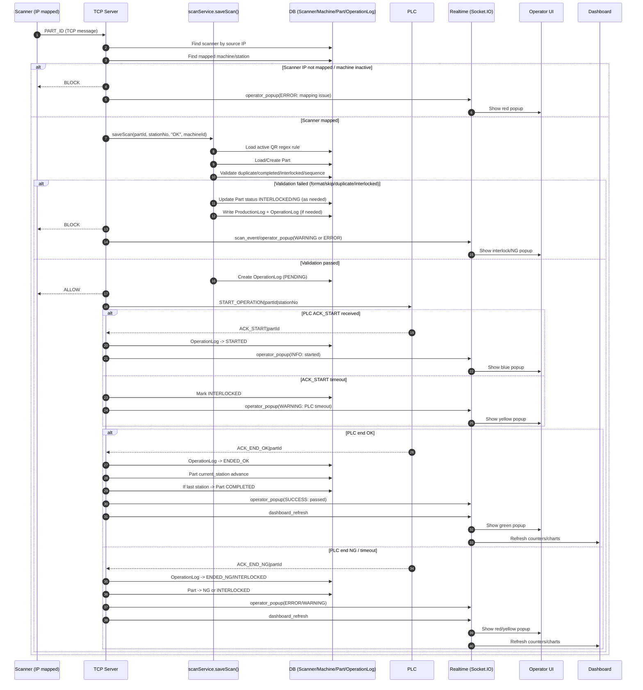
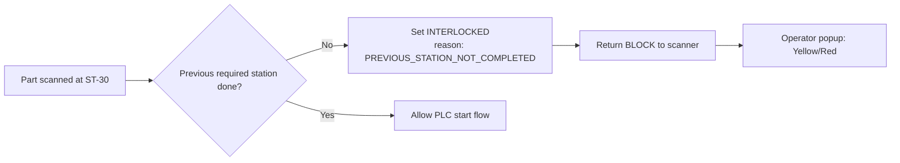
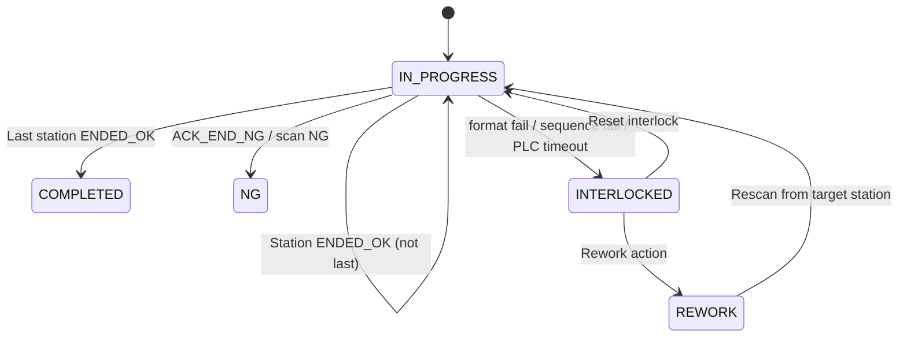

```mermaid
sequenceDiagram
    autonumber
    participant S as Scanner (IP mapped)
    participant T as TCP Server
    participant V as scanService.saveScan()
    participant D as DB (Scanner/Machine/Part/OperationLog)
    participant P as PLC
    participant R as Realtime (Socket.IO)
    participant O as Operator UI
    participant G as Dashboard

    S->>T: PART_ID (TCP message)
    T->>D: Find scanner by source IP
    T->>D: Find mapped machine/station

    alt Scanner IP not mapped / machine inactive
        T-->>S: BLOCK
        T->>R: operator_popup(ERROR: mapping issue)
        R->>O: Show red popup
    else Scanner mapped
        T->>V: saveScan(partId, stationNo, "OK", machineId)
        V->>D: Load active QR regex rule
        V->>D: Load/Create Part
        V->>D: Validate duplicate/completed/interlocked/sequence

        alt Validation failed (format/skip/duplicate/interlocked)
            V->>D: Update Part status INTERLOCKED/NG (as needed)
            V->>D: Write ProductionLog + OperationLog (if needed)
            T-->>S: BLOCK
            T->>R: scan_event/operator_popup(WARNING or ERROR)
            R->>O: Show interlock/NG popup
        else Validation passed
            V->>D: Create OperationLog (PENDING)
            T-->>S: ALLOW
            T->>P: START_OPERATION|partId|stationNo

            alt PLC ACK_START received
                P-->>T: ACK_START|partId
                T->>D: OperationLog -> STARTED
                T->>R: operator_popup(INFO: started)
                R->>O: Show blue popup
            else ACK_START timeout
                T->>D: Mark INTERLOCKED
                T->>R: operator_popup(WARNING: PLC timeout)
                R->>O: Show yellow popup
            end

            alt PLC end OK
                P-->>T: ACK_END_OK|partId
                T->>D: OperationLog -> ENDED_OK
                T->>D: Part current_station advance
                T->>D: If last station -> Part COMPLETED
                T->>R: operator_popup(SUCCESS: passed)
                T->>R: dashboard_refresh
                R->>O: Show green popup
                R->>G: Refresh counters/charts
            else PLC end NG / timeout
                P-->>T: ACK_END_NG|partId
                T->>D: OperationLog -> ENDED_NG/INTERLOCKED
                T->>D: Part -> NG or INTERLOCKED
                T->>R: operator_popup(ERROR/WARNING)
                T->>R: dashboard_refresh
                R->>O: Show red/yellow popup
                R->>G: Refresh counters/charts
            end
        end
    end

```

```mermaid
flowchart LR
    A[Part scanned at ST-30] --> B{Previous required station done?}
    B -- No --> C[Set INTERLOCKED\nreason: PREVIOUS_STATION_NOT_COMPLETED]
    C --> D[Return BLOCK to scanner]
    D --> E[Operator popup: Yellow/Red]
    B -- Yes --> F[Allow PLC start flow]

```

```mermaid
stateDiagram-v2
    [*] --> IN_PROGRESS
    IN_PROGRESS --> IN_PROGRESS: Station ENDED_OK (not last)
    IN_PROGRESS --> COMPLETED: Last station ENDED_OK
    IN_PROGRESS --> NG: ACK_END_NG / scan NG
    IN_PROGRESS --> INTERLOCKED: format fail / sequence fail / PLC timeout
    INTERLOCKED --> REWORK: Rework action
    REWORK --> IN_PROGRESS: Rescan from target station
    INTERLOCKED --> IN_PROGRESS: Reset interlock

```